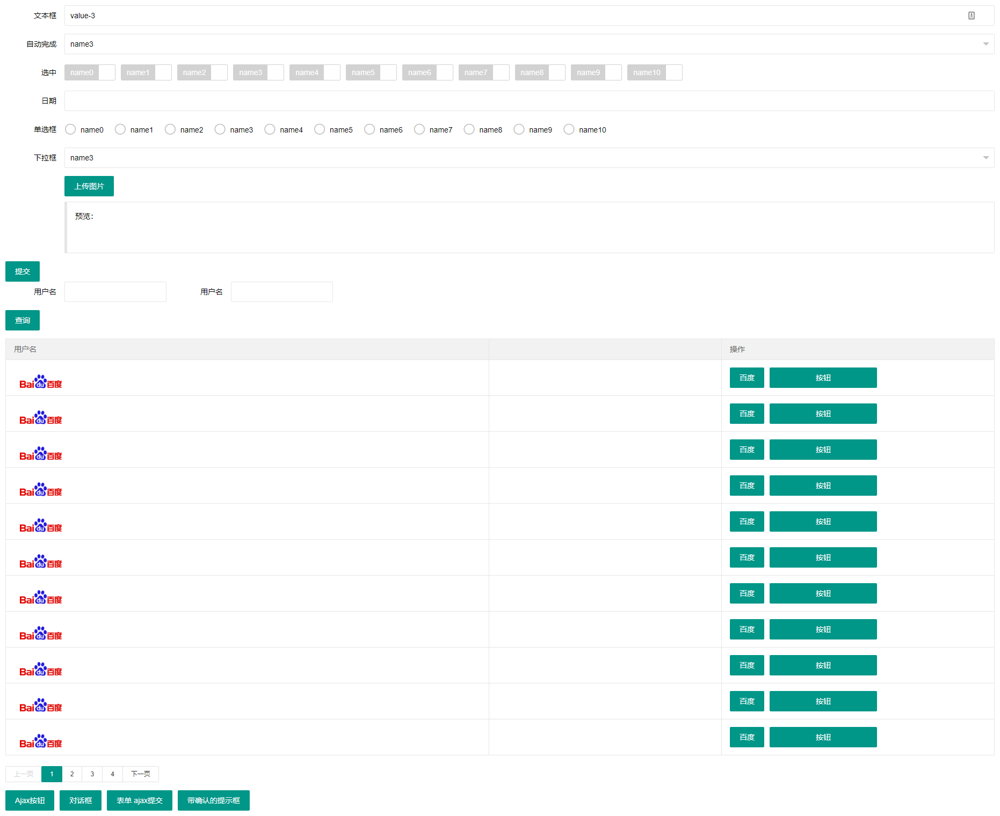

[](https://jitpack.io/#xuejike/spring_xuejike_tpl)

# 基于Kotlin的Layui 后台界面生成器
  该后台界面生成器主要用于快速生成基本的表单和表格界面,非常用的控件可以使用HTML自己实现或者扩展控件库,界面的框架采用的是Layui的控件.
## 1.1 功能 
 - [ ] 生成器控件
    - [x] 文本框
    - [x] 下拉框
    - [x] 自动完成
    - [x] 复选框
    - [x] 日期选择器
    - [x] 单选框
    - [x] 图片上传
    - [x] 文件上传
    - [x] 表格
    - [x] 分页
- [ ] 按钮功能
    - [x] Ajax执行请求
    - [x] 对话框
    - [x] Ajax表单提交
    - [x] 带确认的Ajax执行请求
- [ ] 页面功能
    - [x] 主页
    - [x] 登录页


## 1.2 使用
### 1.2.1 引入依赖
```xml
	<repositories>
		<repository>
		    <id>jitpack.io</id>
		    <url>https://jitpack.io</url>
		</repository>
	</repositories>

    <dependency>
	    <groupId>com.github.xuejike</groupId>
	    <artifactId>spring_xuejike_tpl</artifactId>
	    <version>0.1.1</version>
	</dependency>
```
### 1.2.2 引入Kotlin库和插件
```gradle
apply plugin: 'kotlin'

buildscript {
    ext.kotlin_version = '1.2.10'

    repositories {
        mavenCentral()
    }
    dependencies {
        classpath "org.jetbrains.kotlin:kotlin-gradle-plugin:$kotlin_version"
    }
}

repositories {     
     maven { url "https://jcenter.bintray.com" }
}

dependencies {
    compile "org.jetbrains.kotlin:kotlin-stdlib-jdk8:$kotlin_version"
    compile "org.jetbrains.kotlinx:kotlinx-html-jvm:0.6.6"
}
```
### 1.2.3 使用模板生成器
#### 1、生成一个首页
```java
    @RequestMapping("/index")
    @ResponseBody
    public String index(){
        AdminJkKtView testView = new AdminJkKtView();
        testView.getInfo().setTitle("极速模板");
        //首页地址
        testView.getInfo().setIndexUrl("/index");
        //定义左菜单加载的URL
        testView.getInfo().setLeft("/left");
        //定义头部菜单加载的URL
        testView.getInfo().setTop("/top");
        //定义 右菜单内容
        testView.getInfo().getRightMenu()
                .add(new JkMenu("修改密码","","http://www.baidu.com"));
        //定义首页 初始化界面地址
        testView.getInfo().setWelcomeUrl("/welcome");
        //退出登录地址
        testView.getInfo().setLogoutUrl("/public/logout");
        //定义 当前登录的用户昵称
        testView.getInfo().setUsername("超级管理员");
        return testView.toHtml();
    }
```
效果

#### 2、生成一个表单页
```java
  @RequestMapping("/form")
    @ResponseBody
    public String form(){
        TestFormView view = new TestFormView();
        view.setVo(new TestModel());
        return view.toHtml();
    }
```
```kotlin

class TestFormView: PageJkKtView() {
    var vo:TestModel?=null;

    override fun content(): String {
     return createHTML().div {
        vo=TestModel("ss")
         jkForm {
             jkInput(bind = vo!!::username,title = "文本框", type = InputType.text,inputCall =
             {
                 it.attributes["lay-verify"]="required|number"

             })
            jkFormTitle(){

                jkButton("提交",type = JkButtonType.ajax_submit)

            }
         }

         }


    }

}
```
#### 3、生成一个登录页


## 1.3 扩展
使用Kotlin扩展的特性对Kotlin的html生成器进行扩展。下面这个例子就是扩展出一个带Layui样式的Form表单控件.
```kotlin
fun FlowContent.jkForm(action:String="",
                       method:FormMethod=FormMethod.post,
                       block:FlowContent.(FORM)->Unit={}){
    form(action = action,method = method){
        this.classes+="layui-form"
        block(this)
    }
}
```
## 1.3 表单控件扩展
### 1、组成
    表单控件主要有三部分组成:表单标题、表单块、表单控件。
    下面以输入框为例:
```html
<div class="layui-form-item">
    <!--标题区-->
    <label class="layui-form-label">输入框</label>
    <!--表单块-->
    <div class="layui-input-block">
    <!--表单控件-->
      <input type="text" name="title" class="layui-input">
    </div>
</div>    
```
框架中定义了表单通用的扩展框架:
jkFormTitle 定义一个完整的表单控件区域,包含标题、表单块、基本表单控件。
```kotlin
fun FlowContent.jkFormTitle(title: String="",
                            inline:Boolean=false,
                            formItem:Boolean=true,
                            block:(DIV) -> Unit={}){
    var p={
        label {
            this.classes+="layui-form-label"
            this.text(title)
        }
        div {
            //用于定义当前表单是内联表单或者块表单
            if (inline){
                this.classes+="layui-input-inline"
            }else{
                this.classes+="layui-input-block"
            }

            block(this)
            text("")
        }
    }
    // 用于判断是否添加 layui-form-item 样式
    if (formItem){
        jkFormItem(){
            p()
        }
    }else{
        p();
    }
}
```
### 2、扩展
扩展一个文本框控件
```kotlin
/**
 * input输入框
 */
fun FlowContent.jkInput(title:String="",formItem:Boolean=true,placeholder:String="",name:String="", value:Any?=null,
                        bind: KMutableProperty0<out Any?>?=null, type:InputType=InputType.text,
                        inline:Boolean=false, inputCall:(INPUT)->Unit={},block: FlowContent.() -> Unit={}
                        ){

    jkFormTitle(title, inline, formItem) {
        input {
            //定义input基本的属性
            this.type=type;
            this.autoComplete=false
            this.placeholder=placeholder
            this.classes+="layui-input"
            //通过getBindInfo方法获取需要绑定对象的属性的基本信息
            var info=getBindInfo(
                    bind,
                    name,
                    value
            )
            this.name=info.name;
            this.value=info.valueString;
            //input 回调可以在回调中定义input的其他属性
            inputCall(this)
            //注意 text 方法需要在最后调用,调用后会关闭生成器的流
            text("")
        }
        block(this)
    }
}
```


